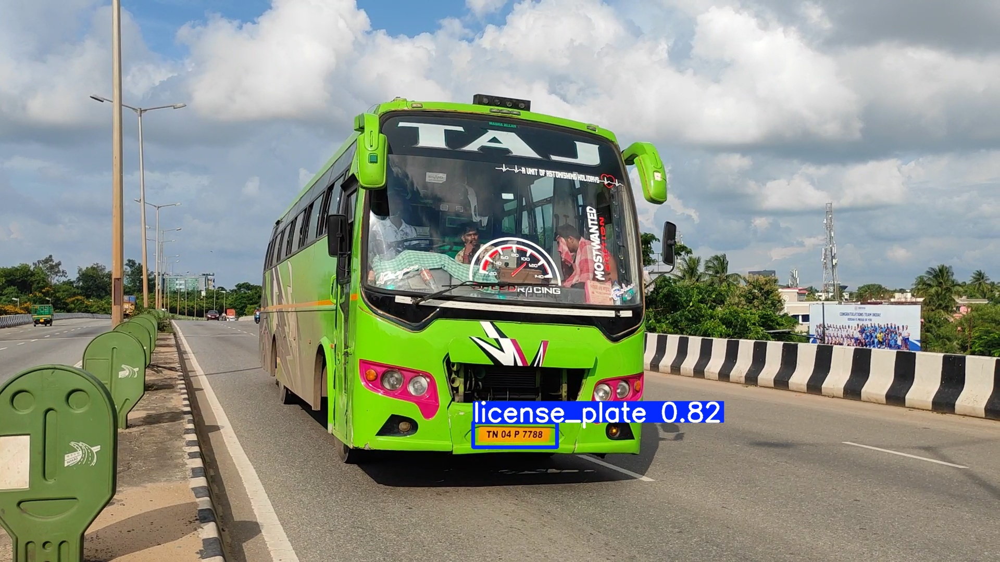
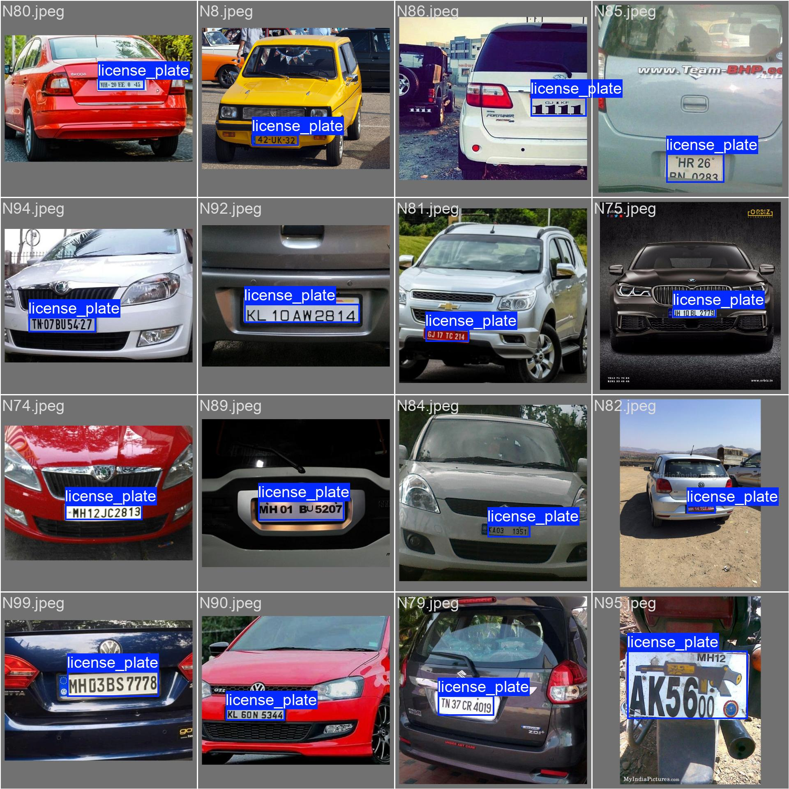

# License Plate Detection using YOLOv10

This project demonstrates real-time license plate detection using the YOLOv10 model. It leverages a custom dataset to detect number plates in live video streams.



## Table of Contents

- [Overview](#overview)
- [Installation](#installation)
- [Dataset](#dataset)
- [Model](#model)
- [Usage](#usage)
- [Results](#results)
- [License](#license)

## Overview

This project aims to detect and localize license plates in real-time using the YOLOv10 architecture. The model is trained on a custom dataset to accurately identify number plates in various conditions.

## Installation

1. Clone the repository:

    ```bash
    git clone https://github.com/alihassanml/License-Plate-Detection-using-YOLOv10.git
    cd License-Plate-Detection-using-YOLOv10
    ```

2. Install the required dependencies:

    ```bash
    pip install -r requirements.txt
    ```

3. Download the dataset from Kaggle:

    ```bash
    !kaggle datasets download -d alihassanml/yolo-number-plates
    ```

4. Extract the dataset:

    ```bash
    unzip yolo-number-plates.zip -d dataset/
    ```

## Dataset

The dataset used for this project is a custom set containing labeled images of number plates. You can download it from [Kaggle](https://www.kaggle.com/datasets/alihassanml/yolo-number-plates).

## Model

YOLOv10 is used for real-time object detection, known for its speed and accuracy. The model is fine-tuned to detect number plates in various lighting and environmental conditions.

## Usage

1. Train the model using the dataset:

    ```bash
    python train.py --data dataset/data.yaml --cfg cfg/yolov10.yaml --weights yolov10.pt
    ```

2. Run the live number plate detection:

    ```bash
    python detect.py --source 0 --weights yolov10.pt --conf 0.5
    ```

    Replace `0` with a video file path if needed.

## Results

The model is capable of detecting number plates in real-time with high accuracy. Sample results are shown below:



- Detected license plates in various live video streams
- Accurate bounding boxes even in low-light conditions

## License

This project is licensed under the MIT License. See the [LICENSE](LICENSE) file for details.
